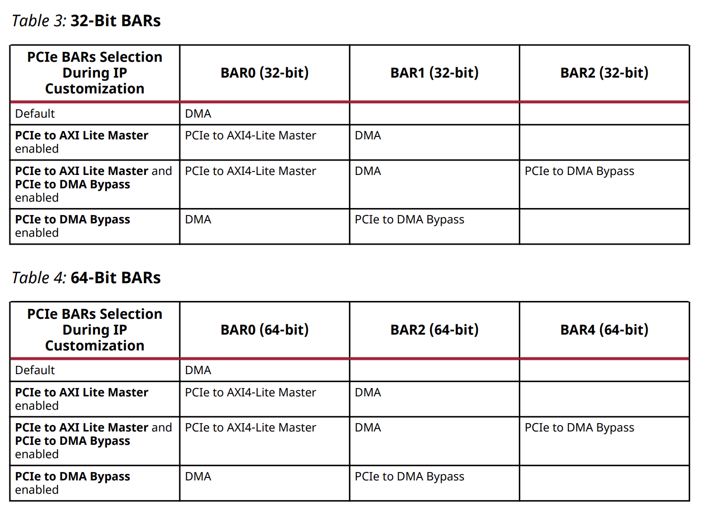

INFO FROM [PG195 DMA/Bridge Subsystem for PCI Express](https://docs.amd.com/r/en-US/pg195-pcie-dma)


## HARDWARE

### 整体架构
下图是XDMA的整体架构


Requester Request(RQ)/Requester Completion(RC), Completer Request(CQ)/Completer Completion(CC)

XDMA整体由DMA和PCIe硬核组成，DMA和User Logic(RTL)进行通信，PCIe通过接口和host进行通信

XDMA既可以配置为DMA模式，也可以配置为Bridge模式。Bridge模式就单纯做PCIe请求和AXI之间的转换，不过Bridge模式有设备限制，可以直接使用另外的PCIe-AXI IP

DMA整体可以分为三个部分，上面的负责核心DMA功能，中间负责中断处理，下面的负责cfg总线以及bypass功能（或者配置的Bridge模式，lite的master和slave功能上并不对称）

核心DMA部分，和PCIe间通过RQ/RC进行通信，支持多Channel，其中H2C(Host to Card)对应写请求，C2H(Card to Host)对应读请求。AXI支持配置为Memory Mapped或者Stream

每个XDMA都可以被配置成最多8个独立的DMA引擎（4个H2C和4个C2H，7 series至多只有2+2），对于H2C和C2H：
- Host-to-Card(H2C)向PCIe生成读请求，并向user logic生成写请求
- Card-to-Host(C2H)向user logic生成读请求，并向PCIe生成写请求

每个DMA引擎都可以被映射到AXI4-Stream或者AXI4-MM总线，AXI4-Stream总线仅data-only

如果有多个H2C或C2H被启用，那么AXI4 Master上的transaction将在所有的channel中交替传输，调度取决于simple round robin协议

下面cfg和bypass部分，它们主要是为了支持host能directly访问user logic，通过如下两种方式：
 - The AXI4-Lite **Master** Configuration port: 该端口固定配置为32bit的读写请求，用于访问user配置和状态寄存器等非关键性能的部分
 - The AXI Memory Mapped Master CQ Bypass port: 该端口宽度和DMA channel保持一致，host通过将请求写入PCIe to DMA bypass Base Address Register(BAR)，来高性能传输user logic数据

此外，user logic可以通过AXI4-Lite **Slave** Configuration来对XDMA本身的内部配置和状态寄存器进行访问，并且访问请求并不能够forward到PCIe，该接口也不能生成任何到host的请求


### PCIe Capability
PCIe Capability具体参考[PCI Code and ID Assignment Specification Revision 1.11](https://pcisig.com/sites/default/files/files/PCI_Code-ID_r_1_11__v24_Jan_2019.pdf)

下面是XDMA支持的PCIe Capability (due to the AXI4 specification)：
 - 1 PF
 - MSI
 - MSI-X
 - PM
 - AER (only PCIe 3.x core)

PCIe硬核并不支持配置expansion ROM


### PCIe BAR

XDMA中可以手动配置的BAR一共有三个：
 - PCIe to AXI Lite Master Interface
 - PCIe to DMA Interface（必选）
 - PCIe to DMA Bypass Interface

其中PCIe to DMA Interface是必须配置的，另外两个是选配的，任意BAR自由选择32/64bit，图中是不同配置模式下BAR的对应关系




### IRQ Module
XDMA支持MSI-X、MSI和Legacy interrupts，均可配置

XDMA可以同时启用多种中断，但是模块最多只能同时发出一种中断类型，优先级MSI-X > MSI > Legacy

官方开源的XDMA驱动中，驱动也是按照上述顺序，检测并启用优先级最高的中断类型

当有interrupt未处理时，host软件端不能够切换中断类型

host端的中断处理程序称为Interrupt Service Routine(ISR)

#### Legacy Interrupts
legacy interrupts启用，且usr_irq_req中一个或多个bit置1时，DMA会通过PCIe发送legacy interrupt

usr_irq_req中多个bit置1时，在usr_irq_ack中对应的bit置1时，usr_irq_req中对应bit必须保持置1

只有当usr_irq_req和usr_irq_ack中对应bit均置1，且相关中断被host端软件处理并清除后，usr_irq_req中对应bit才能置0（为了让host的ISR确定中断来源）

因此，user logic中必须有相关的机制，能够知道ISR已经处理过相关中断了，一般就是通过对register(s)的检测

当usr_irq_req中对应bit置0后，必须等到usr_irq_ack中对应bit再次置1置0后（让PCIe知道中断deassertion），usr_irq_req中对应bit才能置1发送新的中断

usr_irq_req和DMA中断可以映射到legacy interrupt INTA、INTB、INTC、INTD，均可进行配置


#### MSI and MSI-X Interrupts
MSI/MSI-X启用，且usr_irq_req中一个或多个bit置1时，DMA会通过PCIe发送MSI/MSI-X interrupt，如果两个同时启用，那么优先发送MSI-X interrupt

usr_irq_req和usr_irq_ack间流程和Legacy Interrupts大致一样

usr_irq_req和DMA中断可以映射到MSI或MSI-X vectors，均通过configuration registers进行配置

XDMA带有msi_enable和msix_enable输出端口，表示当前启用什么中断类型


### Others
下面是一些PG195中提到的一些限制（针对AXI Bypass和Register access）：
 - 仅支持INCR burst type，其他的type会导致Slave Illegal Burst（SIB）中断
 - 不支持memory type配置（AxCACHE）
 - 不支持protection type配置（AxPROT）
 - 不支持lock type配置（AxLOCK）
 - 不支持非连续的字节使能信号（WSTRB）
 - 对于7 series Gen2 IP，PCIe从host开始的访问必须限制在4bytes transaction

PCIe to DMA Byass Master也有类似的限制：
 - 仅支持INCR burst type
 - 不支持protection type配置
 - 对于7 series Gen2 IP，访问必须限制在4bytes transaction


User Interrupt in MSI-X Mode方面

用户需在IRQ Block User Vector Number寄存器中为每个user interrupt分别配置不同的vector编号，以便为所有user interrupts生成acks信号

当同时发生多个中断时，可以所有user interrupts生成对应的acks。若所有vector编号均指向同一MSI-X条目，则系统仅会生成单一ack信号


## DRIVER
### 总览
xilinx官方开源了[dma相关驱动](https://github.com/Xilinx/dma_ip_drivers)，其中包括XDMA基于linux的驱动

该驱动主要创建若干character device用来对xdma进行控制与数据读写，包括
 - User character device 用于访问user components
 - Control character device 用于控制XDMA本体
 - Events character device 用于等待interrupt events
 - SGDMA character device 用于高性能传输

具体的
 - XDMA0_control：用于访问XDMA的寄存器
 - XDMA0_user：用于访问XDMA的AXI-Lite master接口
 - XDMA0_bypass：用于访问DMA Bypass接口
 - XDMA0_events_*：用于识别user interrupts

详细的chardev类型见`xdma_cdev.c`中的`cdev_type`和`devnode_names`
```c++
enum cdev_type {
	CHAR_USER,
	CHAR_CTRL,
	CHAR_XVC,
	CHAR_EVENTS,
	CHAR_XDMA_H2C,
	CHAR_XDMA_C2H,
	CHAR_BYPASS_H2C,
	CHAR_BYPASS_C2H,
	CHAR_BYPASS,
};
```

CHAR_USER对应m_axi_lite

CHAR_CTRL

CHAR_XVC

CHAR_EVENTS

CHAR_XDMA_H2C和CHAR_XDMA_C2H对应m_axi的DMA

CHAR_BYPASS是真的m_axi_bypass，CHAR_BYPASS_H2C和CHAR_BYPASS_C2H具体情况未知

实际测试中，/dev/xdma0_bypass_h2c_0和xdma0_bypass_c2h_0是r/w到m_axi_lite上的，xdma0_bypass_h2c_1和xdma0_bypass_c2h_1都会出现mapped failed

char_bypass_write和char_bypass_read的实现疑似有问题，/dev/xdma0_bypass在目前的代码中，它的engine是null的


### 中断处理
#### Legacy Interrupts
legacy interrupt是继承自pci协议的旧中断，一共有四根中断线，INTA INTB INTC INTD

#### MSI Interrupts
MSI和MSI-X是PCIE新引入的中断机制，更加高效

理论上MSI支持32个中断向量，不过linux和提供的drvier只支持1个MSI vector

#### MSI-X Interrupts
理论上MSI-X支持2048个中断向量，不过这里的dma只支持最多32个MSI-X

#### User Interrupts
用户逻辑通过拉高usr_irq_req来触发中断，即使收到usr_irq_ack为高时也不能拉低，需要等到驱动处理完相关逻辑后再拉低usr_irq_req


### 流程示例
工作流程分为两种，`H2C(Host to Card)`和`C2H(Card to Host)`

#### H2C
`linux-kernel/tools/dma_to_device.c`是`H2C`的示例用户程序，它从host传输数据到card中

具体流程如下：
1. 打开H2C设备并初始化DMA
2. user程序读取数据文件，分配buffer指针，并传递给写函数，带着H2C和数据大小参数
3. driver基于输入数据大小创建descriptor，并利用descriptor start address初始化DMA，还检查是否有其他相邻的descriptor
4. driver写入控制寄存器来启动DMA传输
5. DMA从host读取descriptor，并针对每个descriptor开始传输过程
6. DMA从host获取数据并发送给user端；所有的数据传输完成后，DMA向host发送中断
7. ISR driver接管中断处理，查找中断来源并检查状态，是否有任何error，并检查有哪些descriptor被处理了
8. 如果DMA状态ok，那么driver就将返回传输完成的字节数给user程序


#### C2H
`linux-kernel/tools/dma_from_device.c`是`C2H`的示例用户程序，它从card传输数据到host中

具体流程如下：
1. 打开C2H设备并初始化DMA
2. user程序基于传输大小分配buffer指针，并传递给读函数，带着C2H和数据大小参数
3. driver基于输入数据大小创建descriptor，并利用descriptor start address初始化DMA，还检查是否有其他相邻的descriptor
4. driver写入控制寄存器来启动DMA传输
5. DMA从host读取descriptor，并针对每个descriptor开始传输过程
6. DMA从Card获取数据并发送给host；所有的数据传输完成后，DMA向host发送中断
7. ISR driver接管中断处理，查找中断来源并检查状态，是否有任何error，并检查有哪些descriptor被处理了
8. 如果DMA状态ok，那么driver就将返回传输完成的字节数给user程序


### 代码说明
驱动入口位于`xdma_mod.c`中
```c++
#define DRV_MODULE_NAME		"xdma"
#define DRV_MODULE_DESC		"Xilinx XDMA Reference Driver"
// ······
MODULE_AUTHOR("Xilinx, Inc.");
MODULE_DESCRIPTION(DRV_MODULE_DESC);
MODULE_VERSION(DRV_MODULE_VERSION);
MODULE_LICENSE("Dual BSD/GPL");
// ······
module_init(xdma_mod_init);
module_exit(xdma_mod_exit);
```


## application


